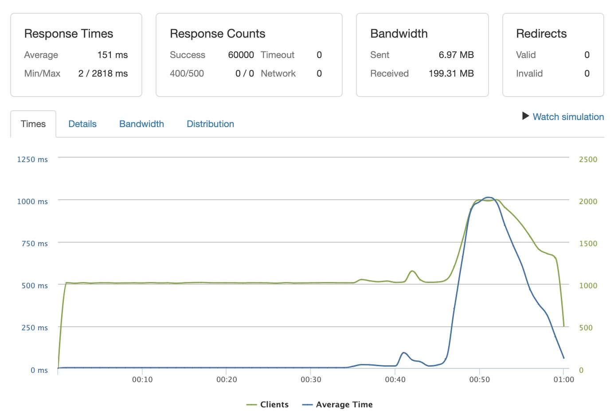

# CommentStarter

*CommentStarter* is a scalable, clean user comment system designed for handling a large user base and optimized for speed. The project is an evolution of a [legacy commentary system](https://github.com/hr-team-jacob/comments-service) that sought to replicate Kickstarter's user comment system. CommentStarter builds on the legacy project by introducing a number of improvements:
- 🚀 Transition from SQLite to a robust, more scalable database: `PostgreSQL`
- 👍 Server and client enhancements to handle extreme bursts in concurrent requests
  - HTTP server provided by [`Fastify`](https://www.fastify.io/) instead of `Express` for improved routing speed of API endpoints
  - Completely revamped client-side code that behaves well when positioned behind a load balancer such as `nginx`
- 🎯 Database schema improvements
  - Appropriate indexing based on most commonly requested endpoints
  - Separation of `user` and `comments` data into their own tables
- 🎨 Clean interface provided by Semantic UI
- 🚢 Dockerfile for rapid deployment

## Related Projects

- [Proxy Server](https://github.com/hrnycjenga/punchstarter-proxy-zackzeyu)

## Table of Contents

1. [Overview](#overview)
1. [Requirements](#requirements)
1. [Usage](#Usage)
1. [Environment-Variables](#environment-variables)

## Overview

####Client Interface:

####Stress tests:
- Database server hosted on a single EC2 t3.2xlarge
  - 70mm `comments` records (spread between 10mm projects), 20mm `users` records
- Node.js component server hosted on a single EC2 t2.micro
- Each request is a `GET` request for a random API endpoint (a project with `id` between `1` and `1,000,000`)
  - Each response requires a `SELECT... INNER JOIN` between the `comments` and `users` tables
#####1k Requests Per Second Over 60 Seconds (0% Error Rate)

#####3k Requests Per Second Over 60 Seconds (0% Error Rate)

## Requirements

- Node v10.13.0 (LTS as of May 2019) or higher
- Nodemon if using the default `npm` script
- PostgreSQL for the database server
- *Optional*: PM2 for keep the server alive and setting the environment variables
- *Optional*: Docker if deploying using docker

## Usage

####Server
> 1. Install dependencies with `npm install`
> 1. Initialize database as per [README](db/seed/README.md) in the `db/seed` folder
> 1. The main server file is `server/index.js`
> -- If nodemon is already installed globally (it is not part of the dependencies), you may start the server via `npm run server-dev`
> -- The server uses port 3011 by default, but you may set it using an environment variable `process.env.PORT`

####Client
> The client side is built using webpack:
>> `npm run dev`: Builds the client-side files in development mode and does not do full bundling. This also activates watch mode by default so it rebuilds whenever you make and save changes
>
>> `npm run build`: Builds the client-side files in production mode, with full bundling. This reduces file size, but is less useful in debugging (some errors do not provide as much detail as in development mode)

## Environment-Variables

#####The following environment variables must be provided to the Node.js/Fastify server
> - `PORT`: Port used by the HTTP server; defaults to `3011` 
> - `PGHOST`: PostgreSQL host address 
> - `PGPORT`: PostgreSQL port 
> - `PGDATABASE`: PostgreSQL database 
> - `PGUSER`: PostgreSQL username 
> - `PGPASSWORD`: PostgreSQL password 